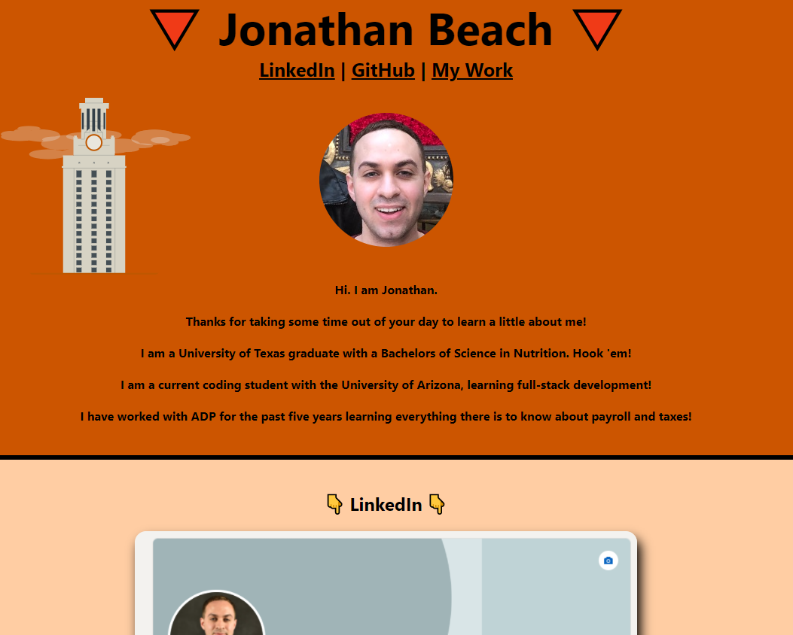

# MY Portfolio
## Description

This application is intended to provide a description about myself, along with my catalogue of work.

## Installation
* None
## Usage
This repository can be opened as an HTML within Github at the website: https://teeemster.github.io/Portfolio/

From here you can navigate around the page to view information about me. You will also be able to click the pictures in the main body of the website, which will take you to visit my LinkedIn, Github profile, or work samples.

    
## Credits
* Jonathan Beach
## License
* 

## Badges
  
* 
* 

